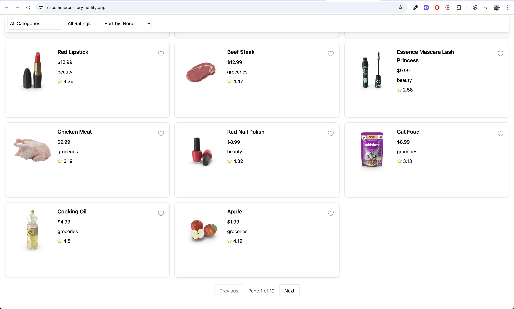

# E-Commerce Product Listing

A modern e-commerce product listing page built with **React**, **Redux Toolkit**, **Vite**, **TailwindCSS**, and **React Toastify**.  
It features filtering, sorting, pagination, favorites, skeleton loading, and a responsive UI.

---

## 🌐 Live Demo

[https://e-commerce-spry.netlify.app/](https://e-commerce-spry.netlify.app/)

---

## 🖼️ Screenshot



---

## 🚀 Getting Started

### Prerequisites

- [Node.js](https://nodejs.org/) (v16 or above)
- [npm](https://www.npmjs.com/) (v8 or above)

### Installation

1. **Clone the repository:**
   ```sh
   git clone https://github.com/krishnath-24/e-commerce-spry
   cd ecommerce-product-listing
   ```

2. **Install dependencies:**
   ```sh
   npm install
   ```

3. **Start the development server:**
   ```sh
   npm run dev
   ```
   The app will be available at [http://localhost:3000](http://localhost:3000).

---

## 🛠️ Tech Stack

- **React**: UI library for building interactive interfaces.
- **Redux Toolkit**: State management for filters, favorites, etc.
- **Vite**: Fast development server and build tool.
- **TailwindCSS**: Utility-first CSS framework for rapid styling.
- **React Toastify**: For toast notifications.
- **Heroicons**: For beautiful SVG icons.

---

## 📦 Directory Structure

```
ecommerce-product-listing/
├── public/
│   └── favicon.ico
├── src/
│   ├── api/
│   │   └── products.js           # API calls for products & categories
│   ├── components/
│   │   ├── filters/
│   │   │   └── Filters.jsx       # Filter bar component
│   │   ├── product/
│   │   │   ├── Card.jsx          # Product card UI
│   │   │   └── List.jsx          # Main product list logic
│   │   └── ProductSkeleton.jsx   # Skeleton loader for products
│   ├── redux/
│   │   ├── productsSlice.js      # Redux slice for products state
│   │   └── store.js              # Redux store setup
│   ├── App.jsx                   # Main app component
│   ├── index.css                 # TailwindCSS imports
│   └── main.jsx                  # Entry point
├── index.html                    # HTML template
├── package.json                  # Project metadata and scripts
├── tailwind.config.js            # TailwindCSS config
├── postcss.config.js             # PostCSS config
└── vite.config.js                # Vite config
```

---

## 📝 Features

- **Product Listing**: Fetches products from [dummyjson.com](https://dummyjson.com/products).
- **Filtering**: By category and rating.
- **Sorting**: By price (ascending/descending).
- **Pagination**: Navigate through pages of products.
- **Favorites**: Mark/unmark products as favorites (persisted in localStorage).
- **Skeleton Loading**: Shows animated placeholders while loading.
- **Responsive Design**: Works on desktop and mobile.
- **Toast Notifications**: For favorite actions.

---

## 📄 License

This project is for educational/demo purposes.

---

## Acknowledgements

- [DummyJSON](https://dummyjson.com/) for the free product API.
- [Heroicons](https://heroicons.com/) for icons.
- [React Toastify](https://fkhadra.github.io/react-toastify/) for notifications.

---